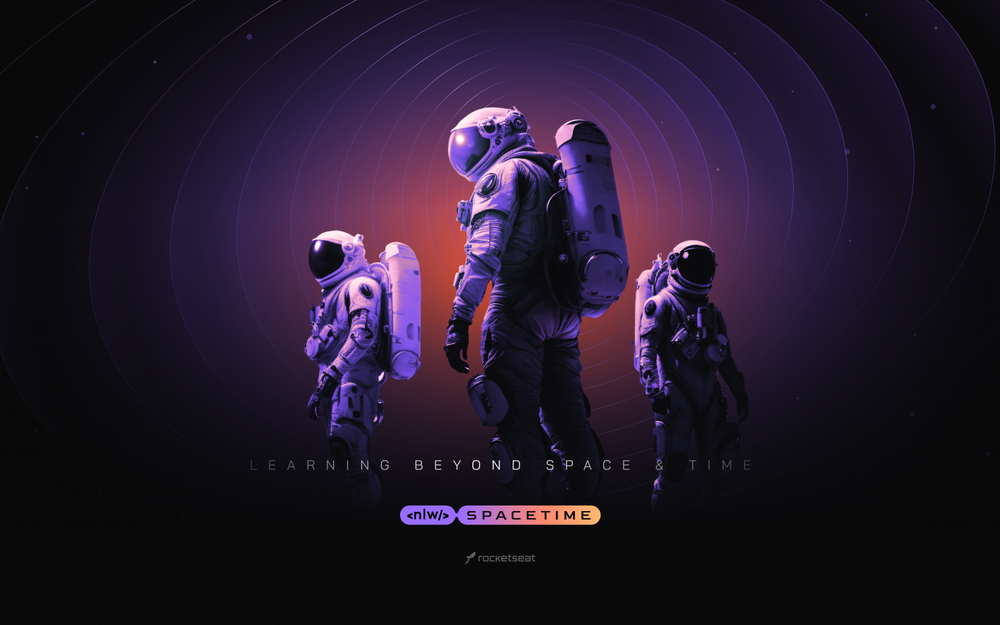

  <a href="#-tecnologias">Tecnologias</a>&nbsp;&nbsp;&nbsp;|&nbsp;&nbsp;&nbsp;
  <a href="#-projeto">Projeto</a>&nbsp;&nbsp;&nbsp;|&nbsp;&nbsp;&nbsp;
  <a href="#-como-rodar">Como rodar</a>&nbsp;&nbsp;&nbsp;|&nbsp;&nbsp;&nbsp;
  <a href="#-como-contribuir">Como contribuir</a>&nbsp;&nbsp;&nbsp;
  

 

  

## NLW Spacetime

## 🚀 Tecnologias

Esse projeto foi desenvolvido com as seguintes tecnologias:

- [Nodejs](https://nodejs.org/en/) - v18.12.1
- [Npm](https://www.npmjs.com/) - 8.19.2
- [Nextjs](https://nextjs.org/)
- [Tailwind](https://tailwindcss.com/)

## 💻 Projeto

Projeto desenvolvido com React para a criação de uma cápsula do tempo.

Evento do NLW na plataforma da [Rocketseat](https://www.rocketseat.com.br/).

- [Back-end - API](https://github.com/leticea/nlw-spacetime-server)
- [Front-end React Native - Mobile](https://github.com/leticea/nlw-spacetime-mobile)

## 🚀 Como Rodar

- Clone o projeto.
- Clone o projeto da API para rodar o projeto junto.
- Entre na pasta do projeto e rode 'npm install' (use 'yarn install' se for essa a sua configuração).
- npm run dev para rodar o projeto na porta indicada.

## 🤔 Como contribuir

- Faça um fork desse repositório;
- Cria uma branch com a sua feature: `git checkout -b minha-feature`;
- Faça commit das suas alterações: `git commit -m 'feat: Minha nova feature'`;
- Faça push para a sua branch: `git push origin minha-feature`.

Depois que o merge da sua pull request for feito, você pode deletar a sua branch.

## 📝 Licença

Esse projeto está sob a licença MIT.